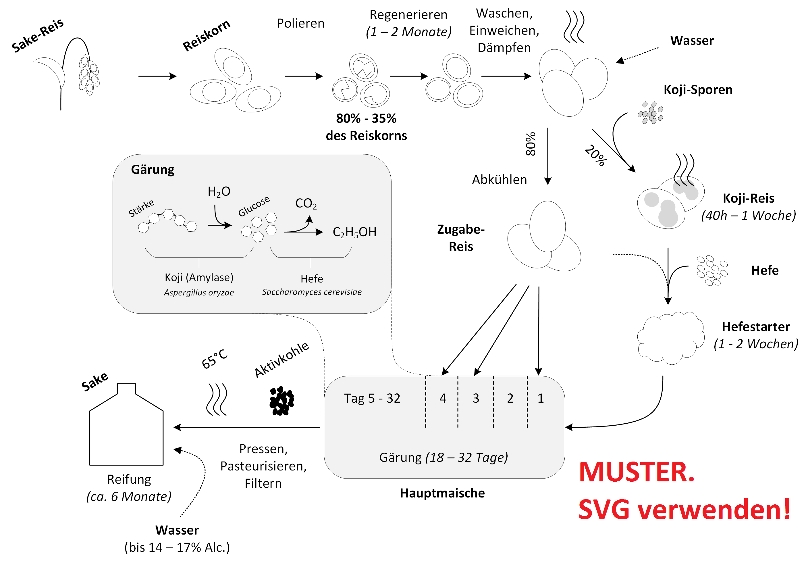

# Sake 

In vielen asiatischen Restaurants kann man mittlerweile *Sake* (日本酒), den traditionellen japanischen Reiswein, bestellen. 
Serviert wird eine dampfende Karaffe mit einem kleinen Schälchen, in das man die heiße Flüssigkeit umfüllt, um sie vorsichtig zu schlürfen. 
Wer dieses Getränk zum ersten Mal probiert und es schafft, sich nicht sofort die Zunge zu verbrennen, dem wird sich eine interessante Erfahrung offenbaren: 
Sake kommt in der Regel etwas weniger sauer als Weißwein, aber ähnlich herb und weniger fruchtig daher.

Leider handelt es sich hierbei meist um günstigen Sake.
Tatsächlich gibt es Sake in unzähligen Varianten, 
z.B. fruchtige, blumig duftende Sorten, die ähnlich wie Weißwein kalt getrunken oder sogar auf Eis serviert werden. 
Während einige Sorten ein schokoladiges oder erdiges Aroma haben, schimmert bei anderen eine leichte Joghurt- oder gar Litschi-Note durch. 

Spätestens nachdem man drei oder vier verschiedene Sake probiert hat, drängt sich unwillkürlich die Neugier auf, wie aus den Ausgangsprodukten Reis und Wasser ein derart vielfältiges Getränk entstehen kann. 
Ähnlich wie bei Wein oder Bier ist auch bei Reiswein sowohl das Ausgangsprodukt, die kleinen Details des Brau- und Gärprozesses und die Lagerung von Bedeutung.

## Wein aus Reis - gar nicht so einfach

Der Herstellungsprozess ist aufwändiger als bei Wein oder Bier. Das liegt daran, dass man zum vergären Zucker benötigt. Reis enthält im Gegensatz zu Trauben aber keinen Zucker und verglichen mit Malz auch keine Enzyme, die Stärke in Zucker umwandeln können. 

Das Prinzip, mit dem man dennoch Reis vergären kann, ist etwa um 300 v.Chr. in China entdeckt worden: 
Ein ungiftiger Schimmelpilz, *Koji* genannnt, produziert das Enzym Amylase, 
was Stärke zu Glucose spaltet. 
Der Pilz kam rasch zum Fermentieren von Sojasoße zum Einsatz; 
Sake-Brauereien gab es jedoch erst im japanischen Kaiserreich ca. 1000 Jahre später. 

## Der Brauprozess im Detail

Ausgangsprodukt für Sake sind spezielle Reissorten. 
Sie zeichnen sich durch einen hohen, in der Mitte des Reiskorns konzentrierten Stärkegehalt aus. 

Die Reiskörner werden zunächst poliert, dadurch verlieren sie die öl- und eiweißhaltige äußere Schicht. 
Als *Polierrate* bezeichnet man den Gewichtsanteil der übrig gebliebenen Stärkekörnchen. 
Hochwertige Sake haben eine sehr niedrige Polierrate: 35 - 50% des Ursprungskorns. 

Beim Polieren entsteht Hitze, die das Korn trocken und rissig macht. 
Daher ruht es danach wenige Monate, um Luftfeuchtigkeit aufzunehmen. 
Daraufhin wird der Reis gewaschen, 
über Nacht eingeweicht und schließlich gedämpft, 
bis er innen weich ist und genügend Wasser aufgenommen hat. 
Ein Großteil davon (sog. *Zugabe-Reis*) wird beiseite gestellt.

Etwa ein Fünftel von dem vorbereiteten Reis wird mit der Koji-Kultur (*Aspergillus oryzae*) besprenkelt und bei hoher Luftfeuchtigkeit einige Tage reifen gelassen. 
Der Koji-Reis wird nun mit Brauhefe (*Saccharomyces cerevisiae*) versetzt. 
Nach ein bis zwei Wochen in kühler Umgebung hat sich die Hefe hinreichend vermehrt, um als Ansatz (*Hefestarter*) für die *Hauptmaische* zu dienen. 

Während der Gärung wird der restliche Zugabe-Reis über mehrere Tage verteilt in die Hauptmaische gegeben.
Das verhindert, dass der Gärprozess gebremst wird, weil Hefe oder Koji-Pilz zu stark verdünnt werden. 
Die Umwandlung von Reisstärke in Glucose durch das Amylase-Enzym aus der Koji-Kultur geschieht nun parallel zur Umwandlung der Glucose zu Ethanol durch die Hefe.

Nach 18 - 32 Tagen erschwert der Alkoholgehalt zunehmend die Arbeit der Hefe. 
Erkennbar wird dies an der nachlassenden CO_2-Produktion: Die Maische schäumt schlichtweg nicht mehr so gut. 
Daraufhin wird der neue Sake ausgepresst und durch Filtern und Pasteurisieren bei 65°C haltbar gemacht.
Um den Geschmack abzurunden, wird er einige Monate in Tanks oder Holzfässern gelagert,
 bevor er auf 14 - 17% Alkoholgehalt verdünnt und abgefüllt wird.

Bei der Zubereitung gibt es also eine immense Anzahl an Parametern, die den Geschmack bestimmen: 
Je niedriger die Polierrate, desto feiner der Geschmack. Das Brauwasser kann durch Härte und Reinheit das Ergebnis beeinflussen, 
weshalb man Sake-Brauereien desöfteren in der Nähe besonderer Quellen findet.
Entscheidend ist auch die Temperatur der Hauptmaische: 
Hochwertige Sake gären bei 10°C, 
während man über 20°C auf Kosten einiger Aromen deutlich schneller zum Endprodukt kommt. 
Je länger der Sake am Ende reifen kann, desto intensiver treten bestimmte Aromen hervor.
Letztendlich spielt, wie bei jedem Wein, das Holz eine Rolle, aus dem das Fass zum Reifen hergestellt wird. 

## Sake probieren

In Anbetracht eines solchen Aufwands ist es nicht verwunderlich, 
dass man für den Preis eines guten Weißweins einen eher herben Reiswein mit hoher Polierrate, schnellem Brauprozess und kaum Reife bekommt. 
Wer gerne Premium-Sake probieren möchte, wird besonders im Online-Handel und einigen gut sortierten Japan- und Asia-Märkten fündig: 
*Masumi*, *Okunomatsu* oder *Akashi-tai* sind Marken, die zunehmend in Europa auftauchen. 
Die verbreiteten 0,3L-Flaschen kosten zwischen 8 und 30€.
Wer sich allerdings umfassend beraten lassen will, für den führt kein Weg an einem Spezialgeschäft (z.b. Sake-Kontor Berlin, www.sake-kontor.de) 
oder einer Wein-Messe (z.B. 20. bis 22. Februar 2015 in Berlin) vorbei.

**[Fotos von Sake-Flasche und Sake-Set einzufügen]**